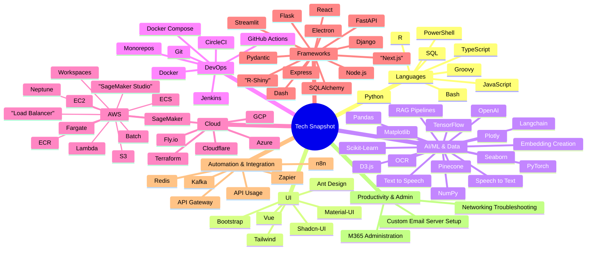

<!-- HEADER -->
<h1 align="center">Hi there, I'm Damilola Ijiwola 👋</h1>

  <b>Cloud DevOps Engineer | AI/ML Enthusiast | Solution Builder</b> 
  <a href="mailto:dami.jiwola@gmail.com">Email</a> •
  <a href="https://www.linkedin.com/in/dami-ijiwola">LinkedIn</a> •
  <a href="https://github.com/Dlola">GitHub</a>

<!-- ABOUT ME -->

  
### 👨🏾‍💻 About Me
- 🚀 Cloud DevOps Engineer with 4+ years of experience
- 🛠️ Building scalable solutions with GCP, Kubernetes, Terraform, Node.js, and more
- 🤖 Passionate about AI/ML, automation, and creative problem-solving
- 🌍 Based in London, UK

<!-- TECH STACK -->
### 🛠️ Tech Stack & Tools

<!-- EXPERIENCE HIGHLIGHTS -->
### 💼 Experience Highlights
- **GFT Financial**: GCP Cloud DevOps Engineer (2023–Present)
  - Deployed and managed infra for high-profile clients (HSBC, etc.)
  - Built robust CI/CD pipelines, automated deployments, and integrated AI/ML workflows
- **Vantage Point Global**: GCP Cloud Engineer (2021–2023)
  - Designed scalable, secure GCP environments for big data and fraud detection
- **Custom Solutions**: Built RAG pipelines, automation bots, and custom APIs for various clients

<!-- CERTIFICATIONS -->
### 📜 Certifications

  
  
  
  
  
  

<!-- LATEST PROJECTS -->
### 🚀 Latest Projects
- **AI-Powered Chatbot**: Custom RAG pipeline using OpenAI, Pinecone, and Express (private, demo on request)
- **Cloud Automation Suite**: Automated workflows with n8n, Zapier, and GCP Functions (private, demo on request)
- **Scalable API Gateway**: Built with Node.js, Docker, and Cloudflare for high-traffic apps (private, demo on request)

<!-- BEYOND TECH / HOBBIES -->
### 🎾 Beyond Tech
When I'm not coding, you'll find me:
- 🏸 Playing tennis & padel
- 🧗‍♂️ Bouldering & hiking
- 🏀 Shooting hoops
- 🏋️‍♂️ Hitting the gym

<!-- LET'S CONNECT -->
---

  <b>Let's connect and build something awesome together!</b> 
  
  
  

<!-- COOL INTRO/FOCUS SECTION -->

---

  

<b>🚀 Most of my work is in private repositories or client projects. 
But here's a snapshot of what I do best!</b>

---
