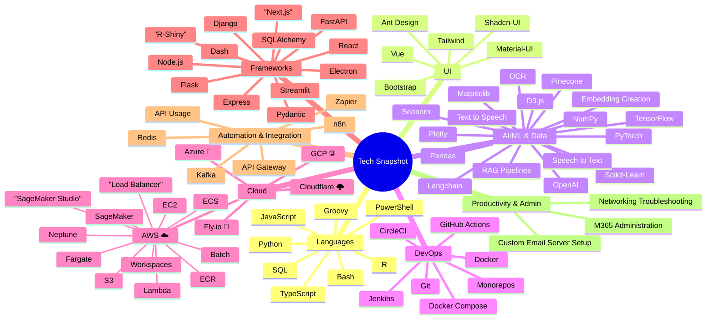

<!-- TABLE OF CONTENTS -->

  <a href="#about-me">👤 About Me</a> |
  <a href="#%F0%9F%9A%A0-tech-stack--tools">🛠️ Tech Stack</a> |
  <a href="#%F0%9F%92%BC-experience-highlights">💼 Experience</a> |
  <a href="#%F0%9F%93%9C-certifications">📜 Certifications</a> |
  <a href="#%F0%9F%9A%80-latest-projects">🚀 Projects</a> |
  <a href="#%F0%9F%8E%BE-beyond-tech">🎾 Hobbies</a> |
  <a href="#lets-connect">🤝 Contact</a>

<!-- HEADER -->
<h1 align="center">Hi there, I'm Damilola Ijiwola 👋</h1>

  <b>Cloud DevOps Engineer | AI/ML Enthusiast | Solution Builder</b> 
  <a href="mailto:dami.jiwola@gmail.com">Email</a> •
  <a href="https://www.linkedin.com/in/dami-ijiwola">LinkedIn</a> •
  <a href="https://github.com/Dlola">GitHub</a>

<!-- ABOUT ME -->

  
### 👨🏾‍💻 About Me
- 🚀 Cloud DevOps Engineer with 4+ years of experience
- 🛠️ Building scalable solutions with GCP, Kubernetes, Terraform, Node.js, and more
- 🤖 Passionate about AI/ML, automation, and creative problem-solving
- 🌍 Based in London, UK

<!-- TECH STACK -->
### 🛠️ Tech Stack & Tools

  <a href="#1-mermaid-mindmap-visual-overview">
     
    <b>🎨 Mindmap</b>
  </a>
  &nbsp;&nbsp;&nbsp;&nbsp;
  <a href="#2-shieldsio-badge-grid-detailed-overview">
     
    <b>💻 Badge Grid</b>
  </a>

---

#### 1. Mermaid Mindmap (Visual Overview)

```mermaid
mindmap
  root((Tech Snapshot))
    Languages
      JavaScript
      TypeScript
      Python
      SQL
      Bash
      PowerShell
      R
      Groovy
    UI
      Tailwind
      Bootstrap
      Material-UI
      Ant Design
      Shadcn-UI
      Vue
    AI/ML & Data
      NumPy
      Pandas
      Scikit-Learn
      TensorFlow
      PyTorch
      Langchain
      Matplotlib
      Seaborn
      Plotly
      D3.js
      OpenAI
      Pinecone
      Embedding Creation
      RAG Pipelines
      Text to Speech
      Speech to Text
      OCR
    DevOps
      Docker
      Docker Compose
      Git
      GitHub Actions
      Jenkins
      CircleCI
      Monorepos
    Cloud
      AWS ☁️
        EC2
        ECS
        ECR
        Fargate
        S3
        Lambda
        "Load Balancer"
        SageMaker
        "SageMaker Studio"
        Neptune
        Batch
        Workspaces
      GCP 🌐
      Azure 🔷
      Fly.io 🚀
      Cloudflare 🌩️
    Frameworks
      React
      "Next.js"
      FastAPI
      Flask
      Express
      Django
      Streamlit
      Dash
      "R-Shiny"
      Electron
      Pydantic
      SQLAlchemy
      Node.js
    Automation & Integration
      Zapier
      n8n
      API Usage
      API Gateway
      Kafka
      Redis
    Productivity & Admin
      Custom Email Server Setup
      M365 Administration
      Networking Troubleshooting
```

---

#### 2. Shields.io Badge Grid (Detailed Overview)

**Cloud**  

**DevOps & Automation**  

**Programming Languages**  

**Frameworks & UI**  

**AI/ML & Data**  

**Vector Databases**  

**Databases & Messaging**  

**Productivity & Admin**  

**Special Skills**  

---

<!-- EXPERIENCE HIGHLIGHTS -->
### 💼 Experience Highlights
- **GFT Financial**: GCP Cloud DevOps Engineer (2023–Present)
  - Deployed and managed infra for high-profile clients (HSBC, etc.)
  - Built robust CI/CD pipelines, automated deployments, and integrated AI/ML workflows
- **Vantage Point Global**: GCP Cloud Engineer (2021–2023)
  - Designed scalable, secure GCP environments for big data and fraud detection
- **Custom Solutions**: Built RAG pipelines, automation bots, and custom APIs for various clients

<!-- CERTIFICATIONS -->
### 📜 Certifications

  
  
  
  
  
  

<!-- LATEST PROJECTS -->
### 🚀 Latest Projects
- **AI-Powered Chatbot**: Custom RAG pipeline using OpenAI, Pinecone, and Express (private, demo on request)
- **Cloud Automation Suite**: Automated workflows with n8n, Zapier, and GCP Functions (private, demo on request)
- **Scalable API Gateway**: Built with Node.js, Docker, and Cloudflare for high-traffic apps (private, demo on request)

<!-- BEYOND TECH / HOBBIES -->
### 🎾 Beyond Tech
When I'm not coding, you'll find me:
- 🏸 Playing tennis & padel
- 🧗‍♂️ Bouldering & hiking
- 🏀 Shooting hoops
- 🏋️‍♂️ Hitting the gym

<!-- LET'S CONNECT -->
---

  <b>Let's connect and build something awesome together!</b> 
  
  
  

<!-- COOL INTRO/FOCUS SECTION -->

---

  

<b>🚀 Most of my work is in private repositories or client projects. 
But here's a snapshot of what I do best!</b>

---
